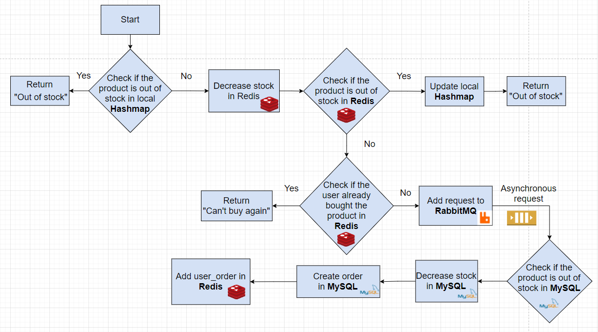
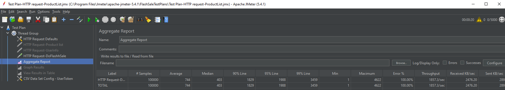
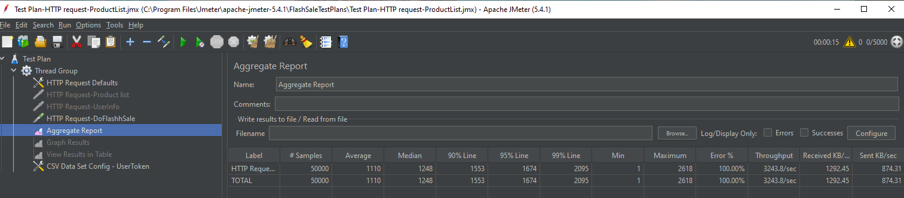
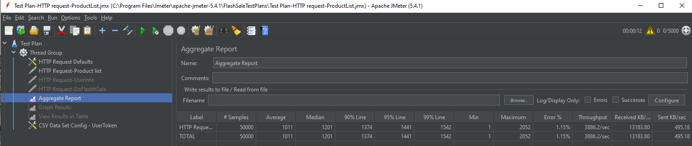
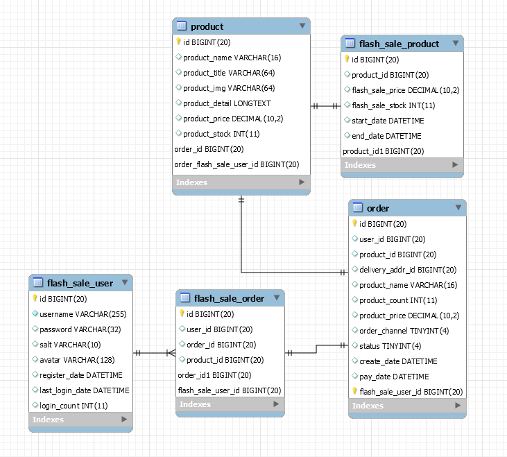
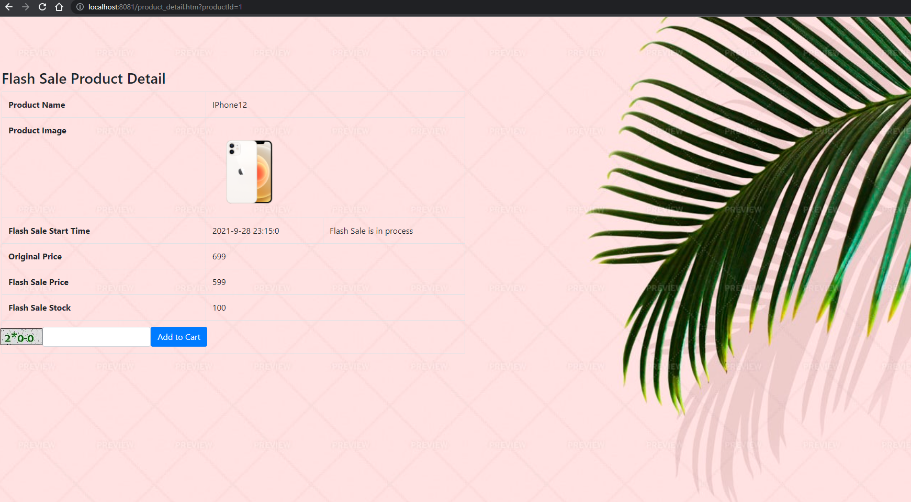
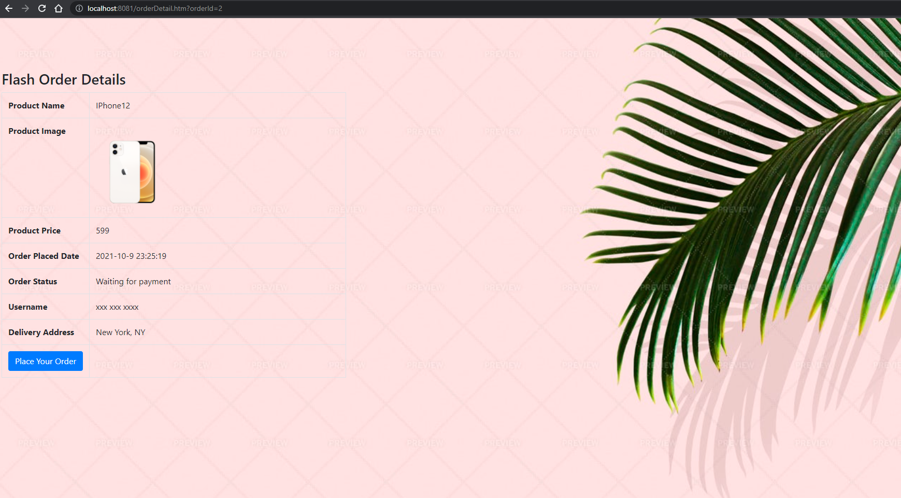

# Flash Sale System

This Flash Sale System is Spring Boot based system, which implements functions as login, check product list, flash sale execution, place orders, etc. It solves issues and improves performance in High Concurrency environment by adding cache, **asynchronous** messaging, limiting request frequency, etc. QPS is about doubled for key APIs requests during load testing in JMeter, which is tested in local machine (Win10) along with a virtual Linux machine (Ubuntu 20.04.2.0).

## Project Structure

 

## Core Technology

- Back-end: Spring Boot, MyBatis, JSR380

- Data Store: MySQL, Redis

- Front-end: Thymeleaf, Bootstrap, jQuery

- Message Queue: RabbitMQ

## Flash Sale Execution Workflow

  

## Optimization

1. **MD5** Encryption Twice

   - Client side: encrypted_password_1 = MD5 (plain pass + fixed salt)
     - Prevent passing plain password on Internet
   - Server side: encrypted_password_2 = MD5(encrypted_password_1 + random salt)
     - Prevent password being stolen from database
   - Stored in Database: encrypted_password_2, random salt

2. Distributed Session Caching

   Generate an UUID for session cookie with expiration and store the associated user into **Redis** in the following key-value format:

   ​		FlashSaleUserKey: sessionId{UUID}  -> {FlashSaleUser object}

   In general, in order to solve a single point of failure, web applications in the production environment will be deployed on multiple platforms. We will not directly use the session of the web container, but store the login information in the third-party storage, Redis. Redis provides a persistent store shared by several instances of the same application under a load balancer (like Nginx), which must share the session.

   **Note**: expiration need to be extended every time when an active user is called.

3. Caching

   - **Redis** - Web Pages Cache

     Implemented Redis to store html web pages.

     First try to get web pages cache from Redis. If failed, render template with ThymeleafViewResolver, add web pages to Reids, and then return the html page.

   - **Redis** - Application Object Cache

     Implemented Redis to store application objects, including user, product list, product stock count, order information, etc., which helps to reduce visits to MySQL and improve the performance. It also provide the ability to scale and meet demand arising.

   - Browser Cache

     Add webpages (product_detail and order_detail) to browser cache and get few dynamic data from server end by **jQuery**. This implementation achieves separating front-end and back-end. It reduces page load time and minimize network traffic.

4. RabbitMQ

   Add user requests into **RabbitMQ** to implement **asynchronous** messaging. On client side, polling the request every 200 milliseconds if it is in queue.

5. Flag of "out of stock" in Memory

   Use memory (HashMap) to mark if a product is out of stock, to reduce communication to Redis.

6. Prevent Overselling

   - Update **SQL** query to execute reducing stock when stock count is greater than 0
   - Add an **unique index** on column user_id and product_id in database, to avoid a user submit multiple requests at the same time for the same product

7. Hide Flash Sale Destination URL for Security

   Utilize MD5 to encrypt a random UUID and append the encrypted UUID in flash sale execution path. Verify the path variable while getting requests.

8. Add Verification Code

   Generate an BuffererdImage of simple math formula as verification code. It helps to distribute users requests while users are placing orders and to prevent malicious bots and warms.

9. Utilize **Interceptor** and **Redis** to limit request times of the user 

   Add a counter in Redis with expiration for a user's specific request (x times per y seconds). Register the interceptor to pre-handle request limits. Flash Sale User is stored in ThreadLocal, which meet current requirement of this high concurrency system that each thread has a single user and it cannot interrupt other threads.

## Load Test

Applied **JMeter** to simulate **50K** concurrent HTTP requests by users for Load Test

Create a thread group with **5000** numbers of threads(users) with 10 loop count to run load test against the main API requests

- POST /flash_sale/do_flash_sale

  - Before optimization:

    Threads: 5000 * 10

    QPS: 1857.3/ sec

    

  - After optimization:

    Threads: 5000 * 10

    QPS: 3243.8/ sec 

     

- GET /product/to_list

  - Before optimization:

    Threads: 5000 * 10

    QPS: 2228.8 /sec

    

  

  - After optimization:

    Threads: 5000 * 10

    QPS: 3886.2/ sec

    ​	 

## Database Schema

 

## Demo

 

 

  

 

 